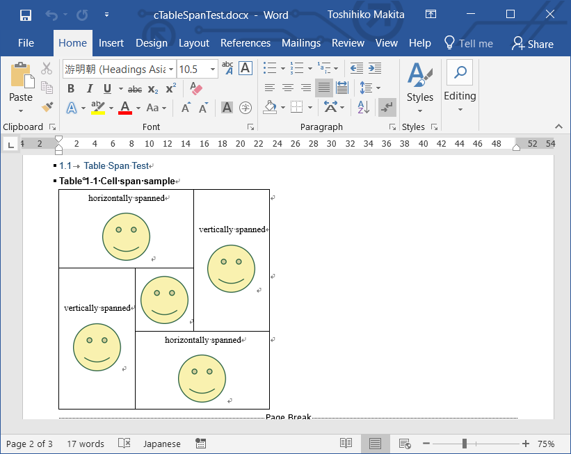

# Antenna House AH-WML plug-in

AH-WML is the [DITA-OT](http://dita-ot.org) plug-in that generates Microsoft Word Document (.docx) from DITA contents.

## Requirements ##

* DITA-OT 2.3 or later
* Saxon-PE/EE 9.8 or later
* JRE 9.0 or later

## Features ##

* Supported images: GIF, PNG, JPEG, TIFF, EMF, SVG (Word 2016 or later) 
* CALS table rendering
* Standard DITA elements, &lt;p&gt;, &lt;ul&gt;, &lt;ol&gt;, &lt;dl&gt;, &lt;pre&gt;

## Example ##

## How to run this plug-in ##

Fork or clone this repository and copy com.antennahouse.wml folder to your \[DITA-OT\]/plugins folder.

From the command-line window at your \[DITA-OT\] folder, run `bin/dita --install` command.

## How to run this plug-in ##

Refer to mHowToRunAhWmlPlugInWithSaxonPeEe.docx for details.

## Notes ##

This project is still work in progress. Many DITA features are not implemented. Please submit your requests to issue list.

## Copyright ##

Copyright (C) 2009-2020 Antenna House, Inc. All rights reserved.
Antenna House is a trademark of [Antenna House, Inc.](http://www.antennahouse.com)

## License ##

This software is licensed under the [Apache License, Version 2.0](http://www.apache.org/licenses/LICENSE-2.0).